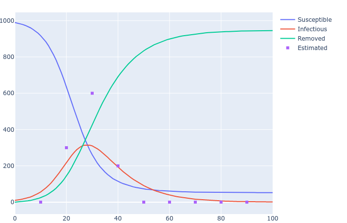

HSIR
=====
Keywords: epidemiology, compartmental model, state-space model, time-varying, regularization

Install
----------
```
git clone git@github.com:WenjieZ/2019-nCoV.git
cd 2019-nCoV
pip install .
```

Dependency
----------
- numpy
- scipy
- plotly (version 4)

Quick start
----------

### Simulation
```python
from hsir.empirical import Region
city = Region(990, 10, 0, 0)  # build a region with 990 susceptible, 10 infectious, 0 removed, 0 quarantined

from hsir.sir import SIR
dynamic = SIR(3, 1, 0.1)  # SIR model (beta=0.3, gamma=0.1)

T = 100  # time horizon
epidemic = dynamic.estimate(city, T)  # simulate the epidemic

from hsir.empirical import Sample
sample = Sample(epidemic, np.arange(T//10, T, T//10), 1000*np.ones(9), 10*np.ones(9), Poi, seed=0)  # sample the epidemic

fig = SIR.plot(epidemic)  # visualize the epidemic
sample.plot(fig)          # visualize the sample
```



### Inference
```python
a = InferSIR()  # infer an SIR model
a.fit(city, sample)  # fit it with the initial condition and the sample
a.dynamic  # the result is stored in the dynamic field
```

Components
-----------

### Models
- SIR
- SIRQ
- SIRt
- SIRQt

### Inference
- InferSIR
- InferSIRQ
- InferSIRt
- InferSIRQt

### Entities
- Region
- Epidemic
- Sample
- Confirmed
- Resisted

Citation
----------
```bibtex
@article{zheng2020total,
  title={Total Variation Regularization for Compartmental Epidemic Models with Time-varying Dynamics},
  author={Zheng, Wenjie},
  journal={arXiv preprint arXiv:2004.00412},
  year={2020}
```

