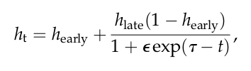

## Objective

- Capture unknown influences (changing behaviors, public interventions, seasonal effects, viral evolution...)
- Assess public health interventions

## Keywords
- Diffusion process
- Time-varying parameter
- (Adaptive) particle MCMC algorithm
- Stochastic differential equations
- Ornstein Uhlenbeck process
- Extended Kalman Filter
- Surveillance: Prevalence vs. Incidence
- Euler-Maruyama scheme
- Particle Gibbs algorithm
- Sequential Monte-Carlo (aka Particle filter)
- Data augmentation
- State-space models (SSM) — a process model and an observation model
- Evidence synthesis
- Back-calculation

## State of the art

### Model for the transmission rate $\beta_t$
- Deterministic
  - Cubic B-splines  [^DaiHa2011mechanistic]
  - Legendre polynomials  [^Smirnova2017forecasting]
  - Sinusoid  [^Stocks2018model]
  - Sigmoid  decay  [^Camacho2014potential]
  - Exponentially decay [^Althaus2014estimating]  [^Chowell2004basic]
- Stochastic
  - White noise  [^Funk2017impact]
  - Wiener process   [^Dureau2013capturing]  [^Camacho2015temporal]  [^Funk2016real]  [^Cazelles2018accounting]  [^Kucharski2020early]
  - Ornstein Uhlenbeck process
  - Gaussian process  [^Xiaoguang2016bayesian]
- Hybrid 
  - Sinusoid process  [^Rasmussen2011inference]
  - Sigmoid process

### Model for other parameters
- Hospitalization rate: deterministic sigmoid function   [^Funk2017impact]
- Case fatality rate: deterministic sigmoid function  [^Camacho2014potential]

### Model for the compartmental transition

- ODE   [^Dureau2013capturing] 
- Stochastic  [^Xiaoguang2016bayesian]

### Estimation method
- Sequential Monte-Carlo [^DaiHa2011mechanistic]
- pMCMC [^Rasmussen2011inference]  [^Dureau2013capturing]  [^Camacho2015temporal]  [^Funk2016real]
- Survey  [^Birrell2018evidence]

### Model selection
- AIC  [^DaiHa2011mechanistic]
- Variational (Tikhonov’s) regularization, truncated singular decomposition  [^Smirnova2017forecasting]
- Prior

### Software
- [SSM library](https://github.com/StateSpaceModels/ssm)  [^Dureau2018ssm]
- fluEvidenceSynthesis  [^vanLeeuwen2017flu]
- pomp

### Framework

State-space framework 

- Evidence synthesis
  -   [^Birrell2018evidence] Surveillance data supplemented by additional serological, demographic, administrative, environmental, or phylogenetic[^Rasmussen2011inference] data  
  - COVID-19  [^Kucharski2020early]
- Transmission mechanic
  - Deterministic epidemic dynamic
  - Stochastic epidemic dynamic

## Trivia
-   [^Siettos2013mathematical] divides the into three categories: 
- large-scale epidemics' random effects in transmission processes can be considered to be well-approximated deterministically [^Kurtz1981approximation]  [^Birrell2018evidence]   [^Siettos2013mathematical]
- SSM can handle genealogy data — coalescent approach  [^Rasmussen2011inference]
- Kalman-simplex algorithm can be used to maximize the posterior [^Camacho2015temporal]
- The 1918 influenza pandemic displayed three distinct waves of infection and mortality within a 12-month period  [^DaiHa2011mechanistic]
- Use confirmed cases as the removals  [^Xiaoguang2016bayesian]
-  [^Althaus2014estimating] uses Nelder-Mead to solve the low-dimensional parameters
- The accumulative confirmed case sometimes decreases  [^Nishiura2014early]

## Appendix
##### Capturing the time-varying drivers of an epidemic using stochastic dynamical systems  [^Dureau2013capturing]

##### 

###### Candidate of  $\mu_x(\cdot)$ and $\sigma_x(\cdot)$

1. $\beta_t$ converges —> Ornstein Uhlenbeck process
2. sigmoid, sinusoid [^Rasmussen2011inference]
3. Brownian motion
4. Cubic splines [^Wahba1990spline]

###### Estimation

- Extended Kalman Filter (EKF) — fast computations, but is based on Taylor and Gaussian approximations whose error could be non-negligible
- Sequential Monte Carlo (SMC)
- pMCMC

##### The impact of control strategies and behavioural changes on the elimination of Ebola from Lofa County, Liberia [^Funk2017impact]

- Healthcare seeking is modelled as sigmoid function 
- Transmission rate $\beta_t$ is modelled as white noise
- Estimated by pMCMC

## References

[^Althaus2014estimating]: Estimating the Reproduction Number of Ebola Virus ( EBOV ) During the 2014 Outbreak in West Africa
[^Birrell2018evidence]: Evidence Synthesis for Stochastic Epidemic Models
[^Camacho2014potential]: Potential for large outbreaks of Ebola virus disease
[^Camacho2015temporal]: Camacho, A.,  Kucharski, A., Aki-Sawyerr, Y., White, M., Flasche, S., Baguelin, M.,  Pollington, T., Carney, J., Glover, R., Smout, E., Tiffany, A., Edmunds, W. and Funk, S., 2015. Temporal Changes in Ebola Transmission in Sierra Leone and Implications for Control Requirements: a Real-time Modelling  Study. *PLoS Currents*,.
[^Cazelles2018accounting]: Accounting for non-stationarity in epidemiology by embedding time-varying parameters in stochastic models
[^Chowell2004basic]: The basic reproductive number of Ebola and the effects of public health measures: the cases of Congo and Uganda
[^Dureau2013capturing]: Dureau, J., Kalogeropoulos, K. and Baguelin, M., (2013). Capturing the time-varying drivers of an epidemic using stochastic dynamical systems. *Biostatistics* __14__(3), 541–555
[^Dureau2018ssm]: 
[^DaiHa2011mechanistic]: He, D.H., Dushoff, J., Day, T., Ma., J. and Earn, D.J.D. (2011). Mechanistic modelling of the three waves of the 1918 influenza pandemic. *Theoretical Ecology* __4__(2), 283–8.
[^Funk2016real]: Real-time forecasting of infectious disease dynamics with a stochastic semi-mechanistic model
[^Funk2017impact]: The impact of control strategies and behavioural changes on the elimination of Ebola from Lofa County, Liberia
[^Kucharski2020early]: Early dynamics of transmission and control of COVID-19: a mathematical modelling study
[^Rasmussen2011inference]: Rasmussen, D.A., Ratmann, O. and Koelle, K. (2011). Inference for Nonlinear epidemiological models using genealogies and time series. *PLoS Computational Biology* __7__(8), e1002136.
[^Smirnova2017forecasting]: Forecasting Epidemics Through Nonparametric Estimation of Time-Dependent Transmission Rates Using the SEIR Model
[^Stocks2018model]: Model selection and parameter estimation for dynamic epidemic models via iterated filtering: application to rotavirus in Germany
[^vanLeeuwen2017flu]: 
[^Xiaoguang2016bayesian]: Bayesian non-parametric inference for stochastic epidemic models using Gaussian Processes

[^Kurtz1981approximation]: Kurtz, T.G. (1981). *Approximation of population processes*. Society for Industrial Mathematics.
[^Nishiura2014early]: Early transmission dynamics of Ebola virus disease (EVD), West Africa, March to August 2014
[^Siettos2013mathematical]: Siettos, C.I., Russo, L., 2013. Mathematical modeling of infectious  disease dynamics. Virulence 4, 295–306. 
[^Wahba1990spline]: Wahba, G. (1990). *Spline models for observational data*. Society for Industrial Mathematics.

