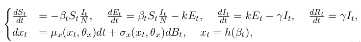

## Objective

- Capture unknown influences (changing behaviors, public interventions, seasonal effects, viral evolution...)
- Assess public health interventions

## Keywords
- diffusion process
- time-varying parameter
- (adaptive) particle MCMC algorithm
- stochastic differential equations
- Ornstein Uhlenbeck process
- Extended Kalman Filter
- Surveillance: Prevalence vs. Incidence
- Euler-Maruyama scheme
- Particle Gibbs algorithm
- Sequential Monte-Carlo (aka Particle filter)
- Data augmentation
- state-space models (SSM) — a process model and an observation model

## State of the art
- $\beta_t$ is modeled with cubic B-splines, estimated with sequential Monte Carlo, model selection via AIC  [^DaiHa2011mechanistic]
- $\beta_t$ is modeled with sinusoid process, estimated with pMCMC  [^Rasmussen2011inference]
- $\beta_t$ is modeled with Wiener process, estimated with pMCMC  [^Dureau2013capturing]  [^Camacho2015temporal]  [^Funk2018real]
- [SSM library](https://github.com/StateSpaceModels/ssm)

## Trivia
- large-scale epidemics' random effects in transmission processes can be considered to be well-approximated deterministically [^Kurtz1981approximation]
- SSM can handle genealogy data — coalescent approach  [^Rasmussen2011inference]
- Kalman-simplex algorithm can be used to maximize the posterior [^Camacho2015temporal]

## Appendix
##### Capturing the time-varying drivers of an epidemic using stochastic dynamical systems  [^Dureau2013capturing]

##### 

###### Candidate of  $\mu_x(\cdot)$ and $\sigma_x(\cdot)$

1. $\beta_t$ converges —> Ornstein Uhlenbeck process
2. sigmoid, sinusoid [^Rasmussen2011inference]
3. Brownian motion
4. Cubic splines [^Wahba1990spline]

###### Estimation

- Extended Kalman Filter (EKF) — fast computations, but is based on Taylor and Gaussian approximations whose error could be non-negligible
- Sequential Monte Carlo (SMC)
- pMCMC

## References

[^Camacho2015temporal]: Camacho, A.,  Kucharski, A., Aki-Sawyerr, Y., White, M., Flasche, S., Baguelin, M.,  Pollington, T., Carney, J., Glover, R., Smout, E., Tiffany, A., Edmunds, W. and Funk, S., 2015. Temporal Changes in Ebola Transmission in Sierra Leone and Implications for Control Requirements: a Real-time Modelling  Study. *PLoS Currents*,.
[^Dureau2013capturing]: Dureau, J., Kalogeropoulos, K. and Baguelin, M., (2013). Capturing the time-varying drivers of an epidemic using stochastic dynamical systems. *Biostatistics* __14__(3), 541–555
[^DaiHa2011mechanistic]: He, D.H., Dushoff, J., Day, T., Ma., J. and Earn, D.J.D. (2011). Mechanistic modelling of the three waves of the 1918 influenza pandemic. *Theoretical Ecology* __4__(2), 283–8.
[^Rasmussen2011inference]: Rasmussen, D.A., Ratmann, O. and Koelle, K. (2011). Inference for Nonlinear epidemiological models using genealogies and time series. *PLoS Computational Biology* __7__(8), e1002136.
[^Kurtz1981approximation]: Kurtz, T.G. (1981). *Approximation of population processes*. Society for Industrial Mathematics.
[^Wahba1990spline]: Wahba, G. (1990). *Spline models for observational data*. Society for Industrial Mathematics.